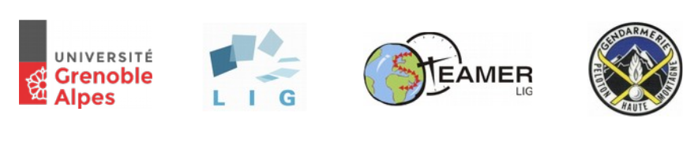

CHOUCAS
=======

Choucas est une application développée par Oton Copi lors de son stage Master IC 2 A - DCISS RS cycle 2015 2016 de l'université Grenoble Alpes en fin de cycle.

Le projet a connu une phase 1 de modélisation. La phase 2 a pour objectif de porter sous le framework geodjango la webapp "Gendloc" précédemment développée.

Elle propose une interface d'administration et une vue utilisateur constituée d'une couche de base et d'overlays métier. Outre les "accessoires" à la carte, Choucas propose un menu accordéon donnant accès à différent outils de recherche et information.

.. image :: ./docs/img/html2.png

Technologies
------------

- Langages : PYTHON, HTML, JS, CSS
- BDD : PostgreSQL, PostGIS
- Serveur : Debian ou Ubuntu
- Framework : Geodjango
- Framework carto : Leaflet
- Fonds rasters : Geoportail, Osm

Installation
------------

Consulter la documentation :  http://choucas.rtfd.org

Utilisation
-----------

Consulter la documentation :  http://choucas.rtfd.org

License
-------

* OpenSource - BSD
* Copyright (c) 2016 - Peloton de Gendarmerie de Haute-Montagne - Laboratoire d'informatique de Grenoble

